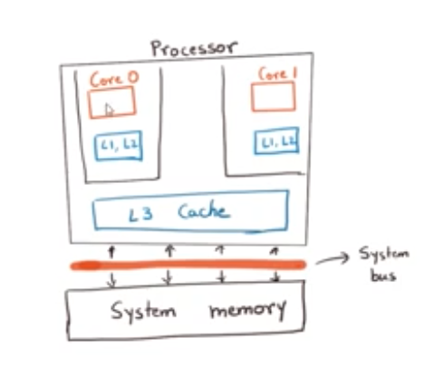

### Notes from **Javabrains** concurrency course

#### Threads
- single sequential flow of control
- a smaller unit of work than a program
- allows program to split into simultaneous running tasks

#### Process
- execution of programs is a process
- multiple programs running means multiple processes running
- binary instr loaded into memory
- gets access to resources like memory
- its own stack, heap, registers
- resources are protected from other processes
- does it own thing
- they are independent
- can be started/stopped without affecting others
- cannot talk to each other unless mechanisms are coded into the process

#### Diff between process and threads
- default execution mode of process is concurrent
- thread is a unit of execution in a process
- thread does the work of a process
- thread has shared resources like memory, heap storage
- processes can be single threaded or multithreaded

#### Java - threads
- A single process - JVM
- consists of various threads
- Application thread - main method
- other threads are doing garbage collection etc


```java
//Runnable is a functional interface
public class MyRunnable implements Runnable{
    public void run(){
        System.out.println("I am running");
    }
}

Runnable r = new MyRunnable();
r.run();//this will not create a new thread
```
#### Steps to follow to spin off a new thread
- Identify the code that you want to run in a separate thread
- put into a runnable - that is implement a Runnable interface as shown above
- put your code into the run method
- create a new thread from the runnable as shown below

```java
Thread t = new Thread(r);//this will create a new thread
t.start();
```

#### How this works
- jvn hands over the thread to the OS threading APIs and then the thread is keeping track of how the OS is running the thread
- thread is a like a metadata object
- when does a thread end
  - when the run method returns
  - an exception is thrown
  - interrupts
  
#### Syntax alternatives
```java
//inline class
Runnable r = new Runnable(){
    public void run(){
        System.out.println("I am running");
    }
}

//using a lambda
Runnable r = () -> System.out.println("Running");

//
new Thread(() -> System.out.println("Running")).start();

//you can extend a thread itself instead of implementing a Runnable
//not usually recommended
class MyThread extends Thread{
    public void run(){
        System.out.println("I am running");
    }
}
new MyThread.start()
```

#### Daemon threads
- when we spawn threads, the application ends only when the last thread ends
- what if we want to end the application without worrying about any threads that are still running?
- you create a daemon thread - this doesn't stop the app from ending/closing
- we typically use daemon threads when you want a background thread that needs to continuously run
- something like a monitoring thread - that needs to be run till the application is running - and not needed after that

#### Thread lifecycle
- Intuitively thinking - just created, running, blocked, terminated
- Actual States
  - New - creation of thread
  - Runnable - when the thread starts
  - Blocked
  - Waiting
  - Timed Waiting
  - Terminated
- Why is the state called Runnable, and not Running? - running _not controlled by JVM but by the OS_. depending on the cores available, scheduler of the OS schedules the thread
- Thread.State enum will tell the current state of the thread


#### Joining Threads
- Joins a certain thread with another running thread
- we do this when we do not want to close the main program till all the threads it has spawned have stopped
- join takes the thread to 'Waiting'

#### Interrupt threads
```java
t.interrupt();
```

#### Parallelism vs Concurrency
- Assume a dual core CPU, and we spin off 3 threads , each taking a long time, does that mean the third thread will not run at all till we see one of the previous threads on either of cores ends?
- That's not how it works
- OS has a scheduler whose responsibility is to schedule all the threads 
- A thread might get unscheduled before it completes
- Scheduler
  - Tries to be fair
  - Honors priorities
  - Non deterministic
- Parallelism - Many tasks _**running**_ at the same time
  - needs multi core cpu
- Concurrency - Many tasks _**in progress**_ at the same time but not running at the same time
  - can be done with multi-core or single core cpu


#### Need for synchronization
- No communication, no data shared - these are simple tasks in concurrent programming
- We want to do multithreading because we want to make efficient use of the cores available
  
- Each core comes with its own memory called processor cache
- Memory that you think of your memory - RAM different from processor cache
- Processor cache - L1(specific to cores), L2(specific to cores) and L3 (shared cache)
- Memory to cache communication happens through system bus
- Processor is makin a copy in the internal cache and then copy it over back after processing to the system memory
- When multiple threads are working on same value of i - we may have a problem
- Threads that just read the data - no issues

#### Common Race conditions
- Check-then-act
  - between the check and the act, the value of the data may change
- Read-modify-write
  - you read one value, then it gets updated by some other thread, but you are not aware, and continue to work with the old value

#### Solving Race Conditions
- we co-ordinate when a certain thread gets access to a thread
- make sure only one thread can "pick up" a data element
- Lock and key model
  - No two threads can access the same piece of code at the same time
  - Synchronization of threads
  - control data, not code
  - provided by JVM

#### How Synchronization works
- JVM creates a "virtual" lock from the data element
- Thread tries to "acquire" a lock
- If it acquires it, it can execute the synchronized code
- Thread finishes executing block and releases lock
- All other threads that need to execute the same block will have to wait


